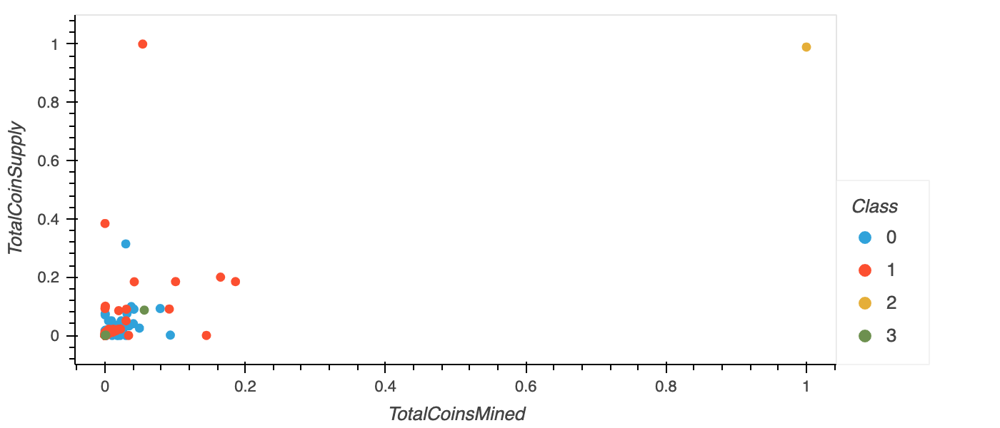

# Cryptocurrencies
Author: Jerome Simmons

## Summary
I've taken an unsupervised learning approach to explore a cryptocurrency data set.
1. Preprocess Data for Principal Component Analysis
2. Reduce Data Dimensions using Principal Component Analysis
3. Utilize K-means algorithm to cluster cryptocurrencies
3. Visualize Cryptocurrency Data

## Sample Images
Below are five outputs from the unsupervised exploration.

#### Preprocessed Data Table with PCA Columns

#### Elbow Curve to Determine Number of K Clusters
Elbow Curve helped determine the appropriate number of clusters: 4.

#### Cryptocurrency Coin Clusters (K = 4)
3D Visual Plot accessible through ipynb file.

#### Table of Tradable Cryptocurrencies
Created interactive table of tradable cryptocurrencies.

#### Coin Supply x Coins Mined Scatter Plot with Cluster Classes (K = 4)
Plotted the coin supply and coins mined, and included cluster class visuals for additional findings.

